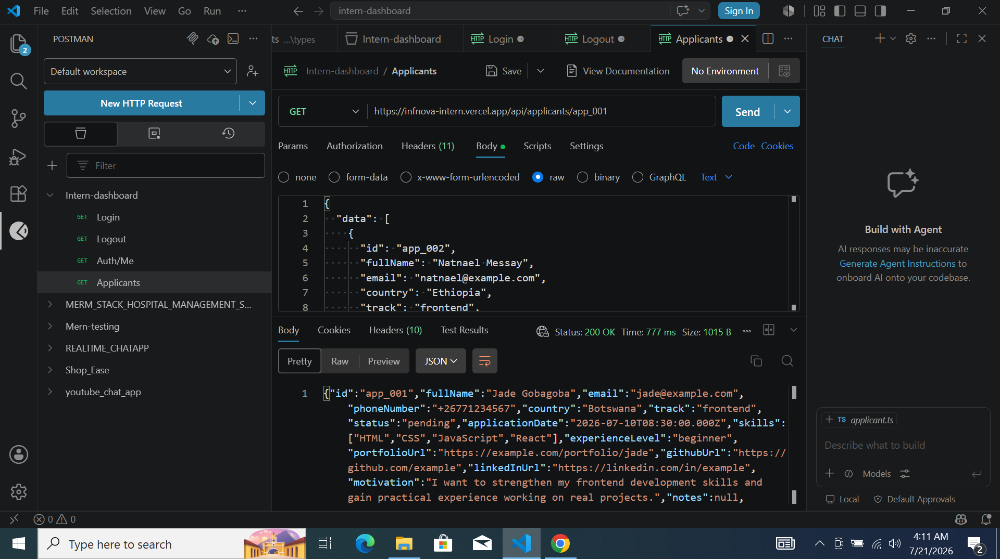
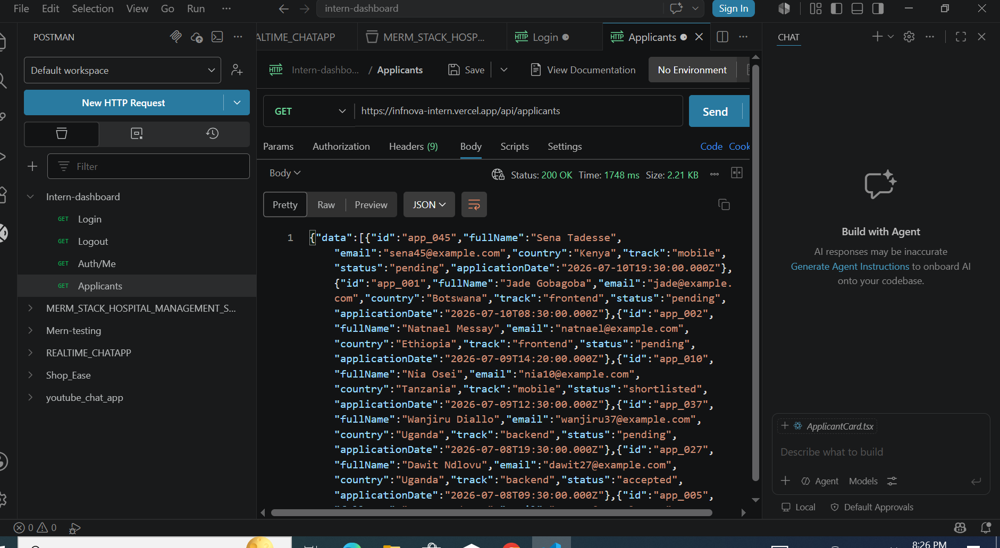
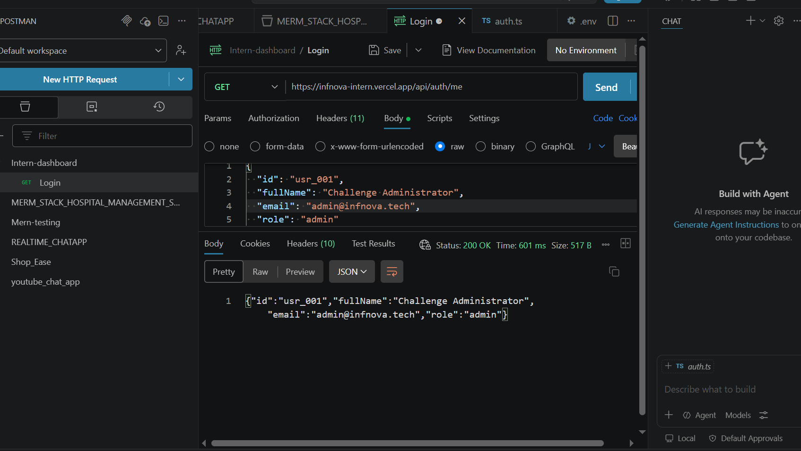
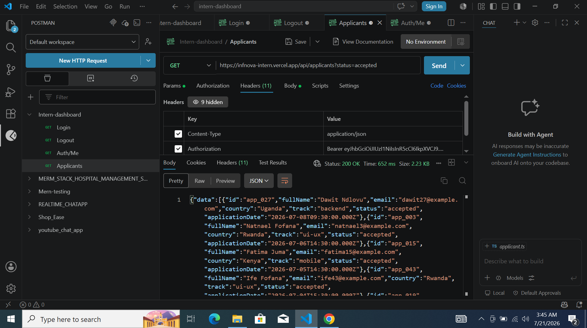

# 🚀 INFNOVA Internship Challenge — Applicant Dashboard
Vercel link:https://infnova-frontend-internship.vercel.app/

# Applicant Management Dashboard

A modern, responsive React application built for the INFNOVA Frontend Internship Challenge.

Built with ❤️ using React, TypeScript, Tailwind CSS, and REST API integration.

---

## 📌 Project Overview

The **INFNOVA Applicant Dashboard** is a frontend application designed to help administrators efficiently manage internship applicants.

The dashboard provides a clean and intuitive interface for viewing applicants, searching and filtering candidates, checking applicant details, and updating application statuses.

The project focuses on:

- Modern frontend architecture
- Type-safe development with TypeScript
- Reusable React components
- API-driven data management
- Responsive user experience
- Handling real-world UI states

---

# ✨ Features

## 🔐 Authentication

- Secure login system
- JWT Bearer token authentication
- Persistent user session
- Protected dashboard routes
- Automatic redirect for expired sessions

---

## 📊 Applicant Dashboard

The dashboard allows administrators to:

✅ View applicants list  
✅ Search applicants by name or email  
✅ Filter by status  
✅ Filter by track  
✅ Filter by country  
✅ Sort applicants  
✅ Navigate through pages using pagination  

---

## 👤 Applicant Details

Users can:

- View complete applicant information
- See application date
- View applicant country and track
- Check current application status
- Update applicant status

Available actions:

- ✅ Accept applicant
- ❌ Reject applicant
- ⏳ Move back to pending

---

## ⚡ API Integration

The application consumes the provided INFNOVA REST API.

Implemented endpoints:

POST /auth/login

Login and receive access token.

---

### Current User

GET /auth/me

Retrieve authenticated user information.

---
### Applicants

GET /applicants
Features:

- Pagination
- Search
- Filtering
- Sorting
- Loading simulation
- Error simulation
GET /applicants/{id}

Retrieve applicant details.

PATCH /applicants/{id}/status
Update applicant application status.

# 📸 Screenshots

## 🔐 Login Page

## 📊 Dashboard

## 📊 applicant-detail

## 📊applicants-api

## 📊 GET applicant by email

## 📊 GET applicant by name

## 📊 GET applicant by status

## 📋 login-api

## 👤 para list

## 📋 Para result

## 📋 post login

## 📋 update-status

---

# 🛠️ Technologies Used

## Frontend

| Technology | Purpose |
|------------|---------|
| React | User interface development |
| TypeScript | Type safety |
| Vite | Development environment |
| Tailwind CSS | Styling |
| React Router | Application routing |
| Axios | API communication |
| Zustand | Authentication state management |

---

# 📁 Project Structure

src
│
├── api
│ ├── axios.ts
│ ├── auth.ts
│ └── applicant.ts
│
├── components
│ ├── Navbar.tsx
│ ├── SearchBar.tsx
│ ├── Filter.tsx
│ ├── ApplicantCard.tsx
│ ├── Pagination.tsx
│ ├── Loading.tsx
│ └── ErrorState.tsx
│
├── hooks
│ ├── useApplicants.ts
│ └── useDebounce.ts
│
├── layouts
│ ├── AuthLayout.tsx
│ ├── DashboardLayout.tsx
│ └── MainLayout.tsx
│
├── pages
│ ├── Login.tsx
│ ├── Dashboard.tsx
│ └── ApplicantDetails.tsx
│
├── routes
│ └── AppRoutes.tsx
│
├── store
│ └── authStore.ts
│
├── types
│ ├── applicant.ts
│ └── auth.ts
│
└── utils
├── helpers.ts
└── validators.ts

---

# ⚙️ Installation & Setup

## 1. Clone Repository

git clone https://github.com/ayenewgirmay21/INFNOVA-Frontend-Internship

Move into project:

cd intern-dashboard
2. Install Dependencies
  npm install
3. Environment Configuration
Create:

.env

Add:
VITE_API_URL=https://infnova-intern.vercel.app/api
4. Start Development Server
npm run dev
Application runs at:

http://localhost:5173
🔑 Authentication Flow

The application uses JWT authentication.

Flow:

User Login
     |
     ↓
API returns Access Token
     |
     ↓
Token stored locally
     |
     ↓
Protected Routes Enabled
     |
     ↓
Authorized API Requests

Every protected request sends:

Authorization: Bearer <token>
🎨 User Interface Highlights

The design focuses on:

Clean dashboard layout
Responsive mobile-friendly design
Reusable UI components
Smooth loading experience
Clear error handling
Empty state handling
🧪 Tested States

The application handles:

Loading State

Using API delay simulation:

?delay=2000

Displays loading indicator while waiting.

Error State

Using:

?simulateError=true

Displays friendly error message with retry option.

Empty State

Displays a helpful message when no applicants match search/filter conditions.

🧠 Development Decisions
Component-Based Architecture

The application was divided into reusable components to improve:

Maintainability
Readability
Scalability
Custom Hooks

Custom hooks were created for:

Applicant fetching logic
Debounced searching

This keeps business logic separate from UI components.

TypeScript Usage

TypeScript interfaces ensure:

Safer API handling
Better developer experience
Reduced runtime errors
🚀 Future Improvements
Possible enhancements:
Advanced applicant analytics
Export applicant data
Dark mode support
More detailed applicant profiles
Role-based permissions
Unit and integration testing
👨‍💻 Developer
Ayenew Girmay Areke
Frontend Developer | Electrical & Computer Engineering Graduate
Passionate about:
React Development
Full Stack Applications
Open Source
Modern Web Technologies
This project was developed as part of the INFNOVA Frontend Internship Challenge.

⭐ Thank you for reviewing my project!

 
